# マインクラフトの勉強

# [minecraft]マインクラフト4: MCreator

この勉強の目的は小学生がマインクラフトのアドオンを作るれるようにする事です。小学生に Visual Studio Code を使ってのアドオン開発はきついので、サードパーティのツールを検討しています。これまで [Blockbench](https://www.blockbench.net/) を使うとそれなりにモブやアイテムを作成できる事が分かったのですが、制限がキツイので他に探して [MCreator](https://mcreator.net/) を見つけました。MCreator は JAVA 版の Mod を作るのが主目的のツールで統合版のアドオンはまだ発展途上ですが、BlockBench に無い mcaddon ファイルのエキスポート機能に対応しているので期待しています。

今日は簡単なブロックを独自に作って mcaddon ファイルを作るまでの流れを試します。

[Download MCreator](https://mcreator.net/download) から EXE Installer を選択してインストール。

Preference > Interface Language: Japanese を選択すると日本語になります。

＋ 新規ワークスペース を選択

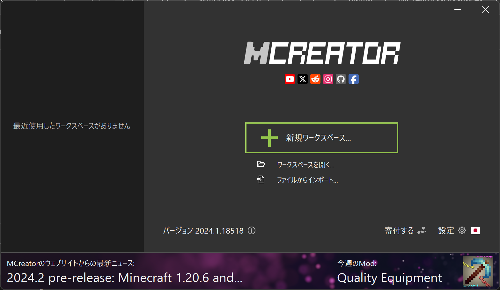

ワークスペースのタイプで Minecraft データパックを選択。

* アドオンの表示名: なんでも良いみたい。
* アドオンID: 英数字。フォルダ名などになる。

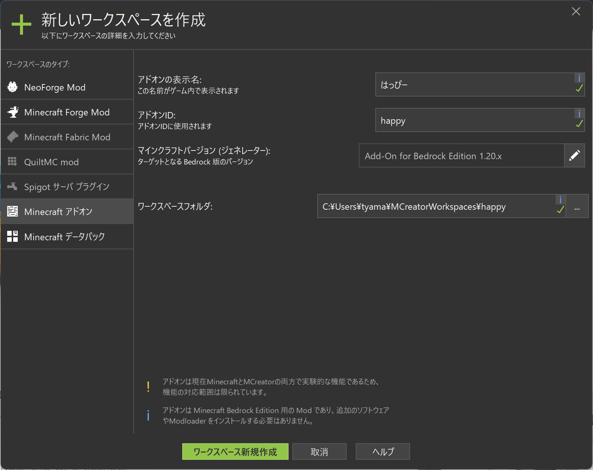

＋ (追加ボタン) > ブロックを選択

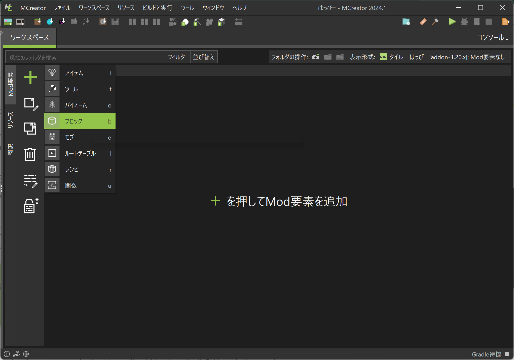

ブロックの名前を入力

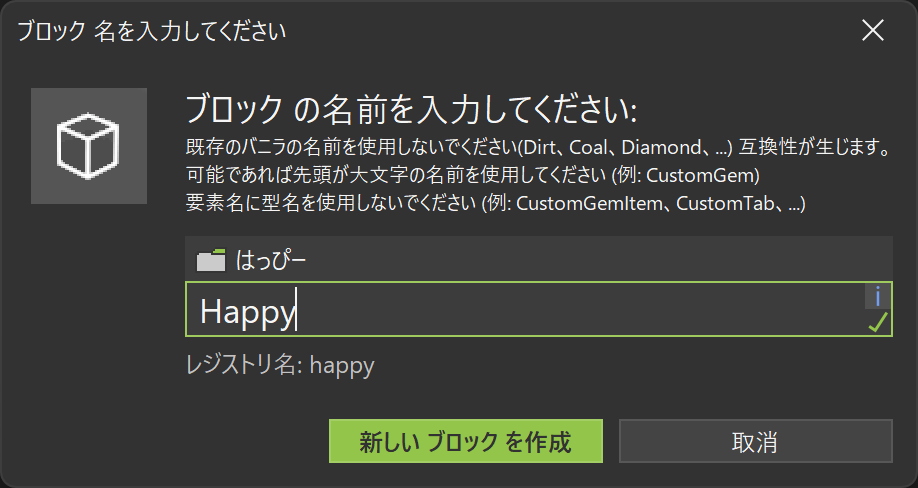

ブロックのテクスチャのどこかを選択する。

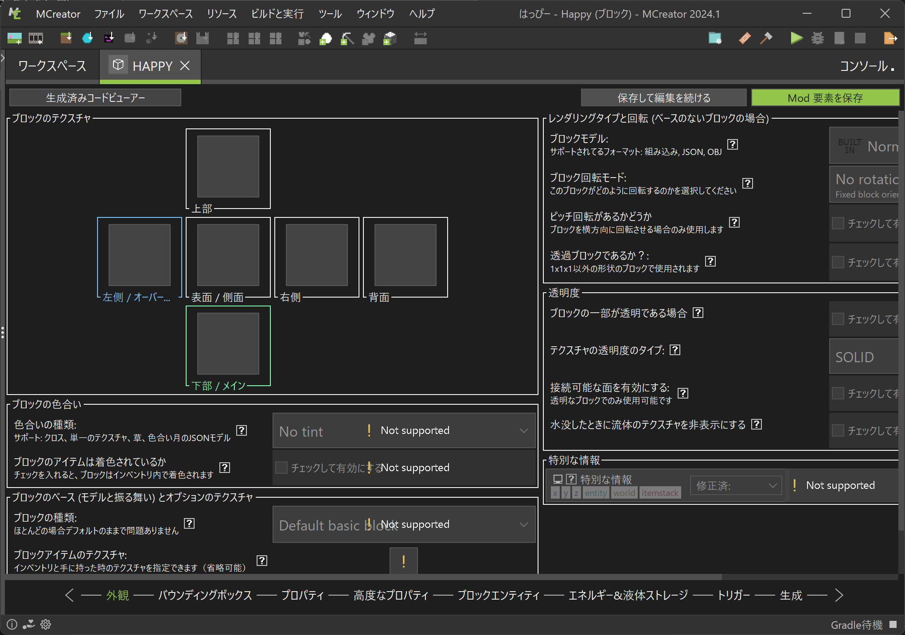

テクスチャを作成

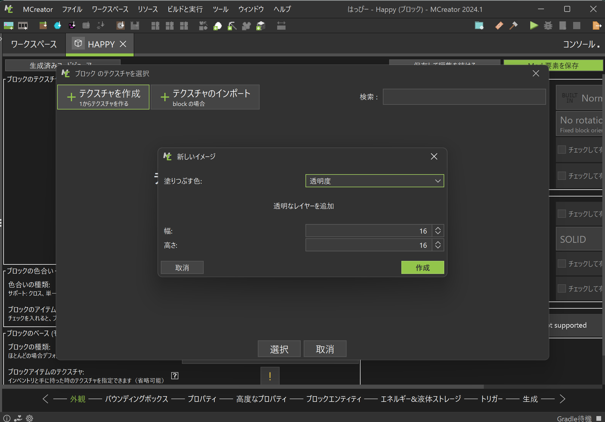

適当にテクスチャを作って「このテクスチャを保存」を選択し、名前を付けます。

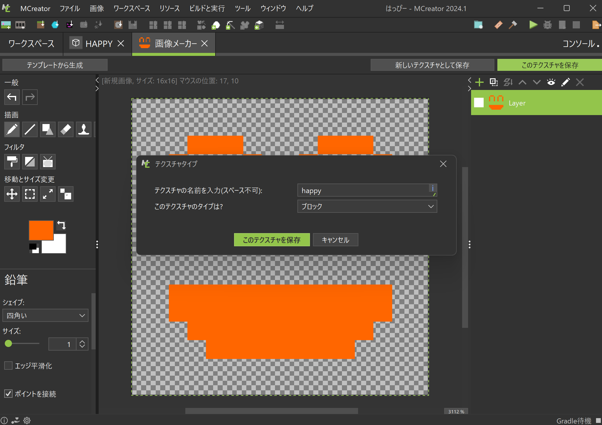

ブロックのそれぞれの面に作ったテクスチャをあてはめます。

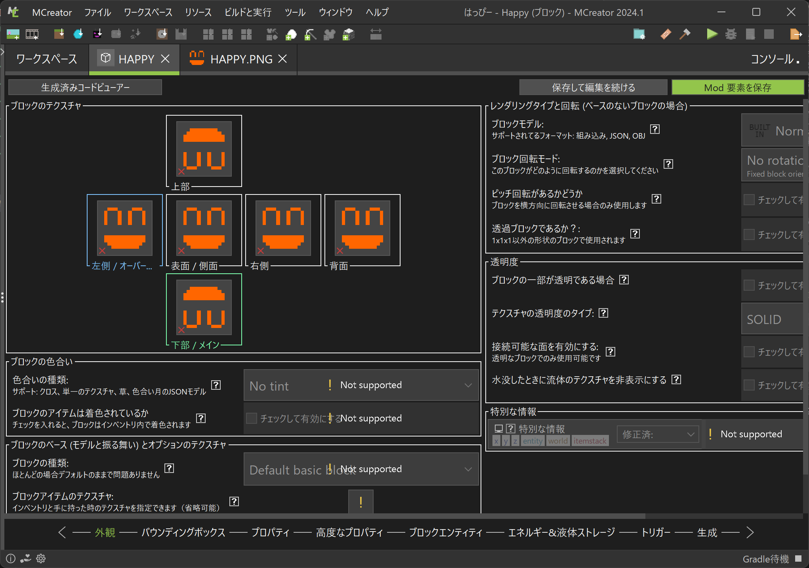

あとは特に難しい部分は無いと思います。画面下のタブ(?)をバウンディングボックス、プロパティと順に選択して好きに設定します。Not supported と出てる奴はまだ対応していない項目です。案外設定できる項目が少ないので迷わないです。

この中で「生成 > このブロックを置き換え可能なブロック」は面白い設定です。例えば以下のようにするとワールドを生成するときに草ブロックの所に作成したブロックが生成されます。

* チェックして有効にする: チェック
* このブロックを置き換え可能なブロック: ＋ を押して grass を追加
* チャンク当たりの鉱石グループの平均量: 32 以下の適当な数
* 鉱石グループ内の平均鉱石数: 32 以下の適当な数
* 生成される高度: 好きな高度の範囲

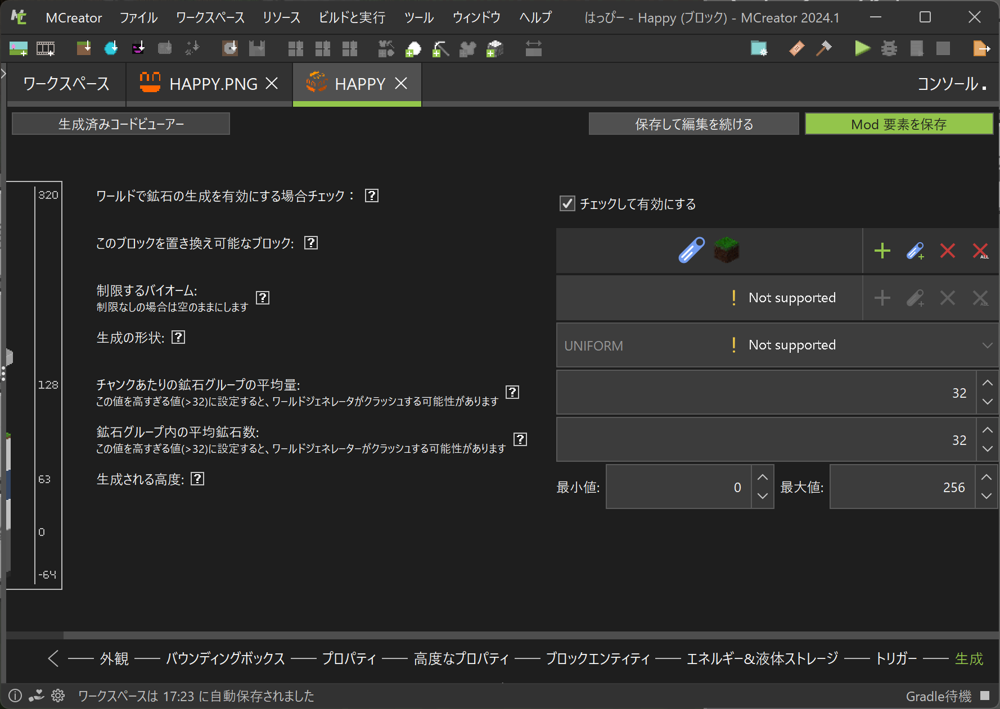

最後に、「Mod 要素を保存」すると完了です。

次に実際にゲームで試してみます。「ビルドと実行 > クライアントを実行」でアドオンがマイクラにインストールされるので、適当にワールドを作ってアドオンを追加します。

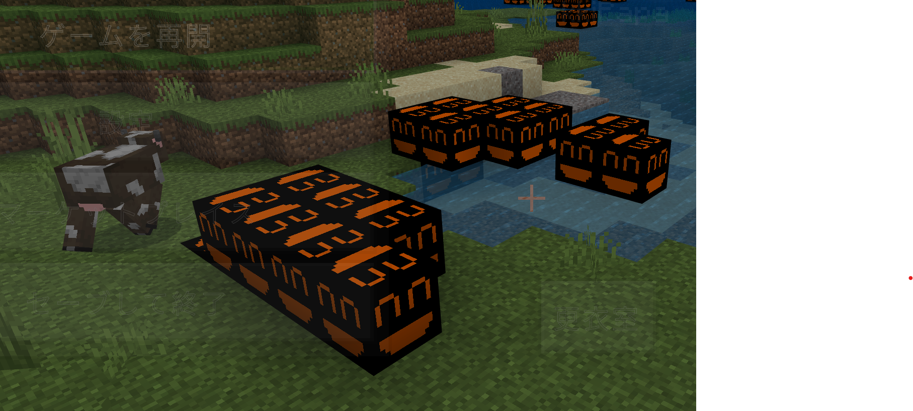

happy ブロックが生成されています。キモイですね。。。

さて、いよいよ mcaddon ファイルの作成です。

ワークスペース > Mod を配布用にエキスポート > 寄付をせずに Mod をエクスポートするを選択し適当にディレクトリを選ぶと mcaddon ファイルができます。

さて、実は作成した mcaddon ファイルをこのままではマイクラに読み込めません。先ほどテストした開発中のアドオンと UUID が被るからです。mcaddon をテストするには、MCreator がテスト用にインストールしたアドオンを削除します。

* マイクラの設定 > ストレージ > リソースパック: 開発中のアドオンを削除
* マイクラの設定 > ストレージ > ビヘイビアーパック: 開発中のアドオンを削除

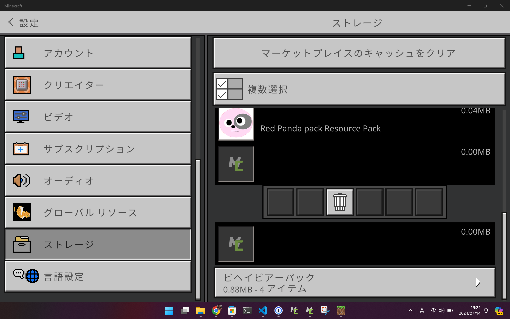

アドオンを削除しても、MCreator のプロジェクトディレクトリには残っているので大丈夫です。ここで、作成した mcaddon ファイルをマイクラで開くと先ほど作成したアドオンがインストールされます。

開発したアドオンと mcaddon からインストールしたアドオンには以下の違いがあります。

* 開発中のアドオン
    * com.mojang 内の development_behavior_packs と development_resource_packs にインストールされる。
    * 普通のマルチプレイでは使えるが、Realms で使えない。
    * 変更が即反映される。
* mcaddon からインストールしたアドオン
    * com.mojang 内の behavior_packs と resource_packs にインストールされる。
    * 普通のマルチプレイでも realms でも使える。
    * 変更は反映されない(多分 mcaddon からの再インストール必要)

今回は MCreator をご紹介しました。MCreator では BlockBench と同様メニューを使ってアドオンの開発ができます。さらに MCreator では mcaddon へのエキスポート機能が用意されているためより実用的です。

参考

* [How To Make a Minecraft Bedrock Editon Mod 2022 - YouTube](https://www.youtube.com/watch?v=xJX5aGdzvAQ)

今後の予定

* MCreator でエンティティを作成する。
    * もしかして、複雑なモデルには BlockBech を使ったほうが良いかもしれない。
    * モデル、スキン、アニメーションについて詳しくなる必要がある。
* MCreator でパーティクルを作成する。
    * * [SNOWSTORM](https://snowstorm.app/) で作った json を取り込む。

---

# [minecraft]マインクラフト3: 教育版マインクラフトの個人購入

妻が [第6回Minecraftカップ](https://minecraftcup.com/) に興味を持ったので調べています。この Minecraft というのに参加するには、JAVA 版でも統合版でもないもう一つの [教育版 Minecraft](https://education.minecraft.net/ja-jp) というのを使わなくてはいけないらしい。教育用 Minecraft については以前少し調べた事があるのだがアカウントの作り方がわからず挫折していたので再び調べました。

非常に分かりにくいのでポイントを整理します。

* 教育版マインクラフトを利用するには教育版のライセンスが必要
    * 学校の Office 365 ライセンスを使える人は学校に頼む(?)
    * うちみたいに学校関係ない人は一人二千円弱/年で「キャンプやクラブ、その他組織で使用するための個別ライセンス」を買える。
* 案内に沿って個別ライセンスを申し込むと、
    * ユーザ名@組織名.onmicrosoft.com というユーザ名をもらえる。
    * Microsoft 365 管理アカウントに一人分教育版マインクラフトライセンスが付いた状態になる。

実際の作業は [Motoko's Blog: 教育版マインクラフトを個人購入してみました](https://www.maisusu.com/blog/purchase-mincraft-education-license) の通りに作業すると大丈夫でした。一応以下に手順を書きます。

* [ライセンス | Minecraft Education](https://education.minecraft.net/ja-jp/licensing)
    * キャンプ、クラブおよび組織 [直接購入](https://aka.ms/MEEBuyCommercial) を押す
* [Purchase Commercial Licenses – Minecraft Education](https://aka.ms/MEEBuyCommercial)
    * Enter your email on [the Minecraft Education commercial purchase page](https://aka.ms/MCEDUCommercialPurchase) のリンクに進む。
    * 自分のメールアドレスを入れる。
    * 名前や電話番号などを入れる。
    * Company name は適当に入れる。
    * クレジットカードを入れる。
    * 1,967円でした。
* 一旦アカウントを作成したら [Microsoft 356 管理センター](https://admin.microsoft.com/) で他のユーザの追加ができる。
    * マインクラフトのサイトの作りが酷くて迷子になるので注意してください。

ここまで調べるのに本家含めて色々参考にしましたが、上記 Motoko's Blog さんの記事以外は難しかったので省略します。

さて、実際に使ってみての感想ですが、どうも同じ発行元(ドメイン?)のユーザ同士でしかマルチプレイできない縛りがあるらしく、うちみたいな不登校の子供たちが一緒に遊んだり学ぶには適切でないという事がわかりました。不登校の親がそれぞれ子供に教育用マインクラフトのライセンスを購入してみんなで Minecraft カップに出そうみたいなのを考えていたのですが、同じ組織に属してないと一緒に遊べないとなると無理です。。。残念。

次回用メモ

* [コードビルダーの始め方と簡単な操作方法](https://mc.akihamitsuki.net/usage-code-connection/)
    * 残念ながら、ここで触れられている [Code Connection for Minecraft は 2023 年で終了していました](https://minecraft.makecode.com/setup/minecraft-windows10)。
* [MCreator](https://mcreator.net/)

---

# [minecraft]マインクラフト2: Creator Learning Journey を眺める。

公式ドキュメントの [Creator Learning Journey](https://learn.microsoft.com/en-us/minecraft/creator/documents/learningjourneyguide?view=minecraft-bedrock-stable) を読むと、マイクラ開発初心者が学ぶべき項目が整理されています。これを読みながらアドオン勉強の道筋を考えます。

## Step1 何がどこにあるか確認しよう

[Getting Started With Minecraft Add-Ons | Microsoft Learn](https://learn.microsoft.com/en-us/minecraft/creator/documents/gettingstarted?view=minecraft-bedrock-stable&tabs=Windows10)

基本的なアドオンの知識について書かれてあります。特に大切なのはアドオンにとっての魔法のパス

    %localappdata%\Packages\Microsoft.MinecraftUWP_8wekyb3d8bbwe\LocalState\games\com.mojang

です。これを Win+R に打ち込むとマイクラのデータディレクトリが開きます。アドオン開発はこの `com.mojang` ディレクトリ内で行います。スタートにピン止め推奨です。

### ビヘイビアパックとリソースパック

アドオンはビヘイビアパックとリソースパックの二種類あります。それぞれ役割が違っていて、あるアドオンをインストールするときは典型的にはビヘイビアパックとリソースパックの両方を読みます。

* リソースパック: 見た目を制御する部品です。クライアント側で動作します。
* ビヘイビアパック: 動きを制御する部品です。サーバ側で動作します。

参考: [Creating New Entity Types > File structure](https://learn.microsoft.com/en-us/minecraft/creator/documents/introductiontoaddentity?view=minecraft-bedrock-stable#file-structure)

## `com.mojang` の構造

`com.mojang` には以下のようなディレクトリがあります。

* behavior_packs: インストールされたビヘイビアパック。インストール時のみ更新されます。
* resource_packs: インストールされたリソースパック。インストール時のみ更新されます。
* development_behavior_packs: 開発中のビヘイビアパック。ローカルや Realms の world にはコピーされない。内容即時更新。
* development_resource_packs: 開発中のリソースパック。ローカルや Realms の world にはコピーされない。内容即時更新。
* minecraftWorlds
    * (ワールドごとの ID)
        * behavior_packs: 有効にしたビヘイビアパックがコピーされる。(development_behavior_packs にあるものはコピーされない)
        * resource_packs: 有効にしたリソースパックがコピーされる。(development_resource_packs にあるものはコピーされない)

ここで、development_ で始まるディレクトリが開発ように特別に用意されたアドオン用のディレクトリです。以下の違いがあります。

* development_ で始まるディレクトリは内容が即更新されて開発に便利な一方で、world にコピーされないので Realms では使えない。
* development_ で始まらないディレクトリは作成時に minecraftWorld の各 world ディレクトリにコピーされるため、Realms でも使える。

前回 Blockbench で作成したアドオンが Realms で使えないと言った理由はここにあります。Blockbench ではアドオンを development_ で始まるディレクトリに作成するので、マイクラ内の設定で有効にしても minecraftWorlds にコピーされず、Realms サーバにもアップロードされません。

作成したアドオンを Realms で使うには zip で固めて .mcaddon ファイルを作成し、適切にマイクラにインストールさせる必要があります。

[Comprehensive List of Pack Contents](https://learn.microsoft.com/en-us/minecraft/creator/documents/comprehensivepackcontents)

## Step2 何か作ってみよう

この章では、リソースパックとビヘイビアパックの基礎知識を解説しています。

[An Introduction to Resource Packs](https://learn.microsoft.com/en-us/minecraft/creator/documents/resourcepack?view=minecraft-bedrock-stable)

[An Introduction To Behavior Packs](https://learn.microsoft.com/en-us/minecraft/creator/documents/behaviorpack?view=minecraft-bedrock-stable)

ここでのポイントは以下と思いました。

* リソースパックは既存のマイクラの見た目を変更できる。
* 既存の見た目を変更するには、[Vanilla resource pack](https://aka.ms/resourcepacktemplate) でファイル名を調べると良い。
* ビヘイビアパックは既存のマイクラの動きを変更できる。新規のエンティティも作成できる。
    * ビヘイビアパックからリソースパックへの依存を設定すると、依存するリソースパックを自動インストールできる。

## Step3 もっと複雑なものを作ってみよう

読んでないのでリンクだけコピペ

* [Add a Custom Sounds](https://learn.microsoft.com/en-us/minecraft/creator/documents/addcustomsounds)
* [Create an Entity](https://learn.microsoft.com/en-us/minecraft/creator/documents/introductiontoaddentity)
* [Create a Custom Block](https://learn.microsoft.com/en-us/minecraft/creator/documents/addcustomdieblock)
* [Create a Sushi Block: Advanced Custom Blocks](https://learn.microsoft.com/en-us/minecraft/creator/documents/advancedcustomblocks)
* [Create a Custom Item](https://learn.microsoft.com/en-us/minecraft/creator/documents/addcustomitems)

## さらに上級編

* [Commonly Used Tools](https://learn.microsoft.com/en-us/minecraft/creator/documents/commonlyusedtools?view=minecraft-bedrock-stable)
* [Animate a Block Texture](https://learn.microsoft.com/en-us/minecraft/creator/documents/createanimatedblocktexture?view=minecraft-bedrock-stable)
* [Create a Goblin Chef Entity](https://learn.microsoft.com/en-us/minecraft/creator/documents/makerseriesmakingthegoblinchef?view=minecraft-bedrock-stable)
* [Create a Loot Table](https://learn.microsoft.com/en-us/minecraft/creator/documents/createloottable?view=minecraft-bedrock-stable)
* [Create a Village with Structure Blocks](https://learn.microsoft.com/en-us/minecraft/creator/documents/structureblockstutorial?view=minecraft-bedrock-stable)
* [Non-Player Character (NPC) Dialogue](https://learn.microsoft.com/en-us/minecraft/creator/documents/npcdialogue?view=minecraft-bedrock-stable)

とまあこの線に沿って勉強していきます。ただ、飽きてきたので [MCreator](https://mcreator.net/) を調べよっかな。

---

# [minecraft]マインクラフト1: アドオン勉強の記録を始めます。

マインクラフトの素晴らしいところは、一通り普通に遊んだ後で、マーケットプレイスや HIVE など色々な追加機能で無限に遊び方が広がる事です。そのマインクラフトの拡張に中心的な役割を果たすのが「アドオン」という機能です。アドオンというのは zip で固められた設定ファイルのようなもので、既存のスキンや動作を上書きしたり、新しいモブやアイテムを作成できます。アドオンの機能は強力で、マイクラの上に FPS や人狼など、まったく新しいゲームを構築する事すらできてしまいます。

うちの子供たちも、マイクラを初めるとすぐに「アドオンを作りたい！」と言い始めました。その希望を叶えるために半年前から時間を見つけてはアドオンについて調べているのですが、週末の限られた時間しか無く、すぐに調べたことを忘れてしまうので、ここに記録を残しながら調べていく事にします。

## 目標

* 小学生が簡単にマイクラのアドオンを作れる。
* 好きなスキンのドラゴンを作れる。
* かっこいい剣を振るとすごいパーティクルが出る。

## マイクラアドオン基本情報

マイクラアドオン開発に必要な基本的な情報を書きます。まずマイクラには統合版と Java 版という二つの種類があります。ここでは統合版のみ触れます。統合版には任天堂スイッチで遊べるという絶大なアドバンテージがあるので、お子様におすすめしやすいです。一方で、残念な事に Mac 版が存在しないという欠点があります。という事でマイクラ統合版のアドオン開発には Windows 機が必須となります。Mac に慣れた自分にはこれが一番キツイが仕方がない。。。

一般に、マイクラアドオンというとマイクラ統合版のアドオンを指します。Java 版の拡張機能は Mod と言って完全に別の仕組みです。

アドオン開発の公式サイトは [マインクラフト クリエーター](https://www.minecraft.net/ja-jp/creator) です。Microsoft らしい素晴らしい参考資料ですが、中身は英語なので子供には難しいかも知れません。

## サードパーティーのツールによるアドオン開発

アドオン開発には様々なサードパーティーツールが存在します。特に公式サイトで紹介されている [Blockbench](https://blockbench.net/) の Plugin を使えば、小学生でも簡単にアドオンを作成する事ができます。英語ですが [Getting Started with Minecraft Entity Wizard](https://learn.microsoft.com/en-us/minecraft/creator/documents/minecraftentitywizard) に解説があります。BlockBench を使えば、既存のマイクラのモブを元にスキンを変えたり動きを変えたり簡単にできます。例えば空を飛ぶニワトリとかを作れます。

ただ、Blockbench の Plugin だけでは色々機能が不足していて、例えば作ったアドオンを Realms で共有するのが子供には難しいです。Blockbench の本来の目的は低ポリゴンの 3Dモデルを作る事らしいので、Blockbench とほかのツールを組み合わせる必要があるのではないかと思っています。いくつかのツールを紹介します。

* [Blockbench](https://www.blockbench.net/)
    * 本家でも紹介されているローポリモデリングツール。Plugin で簡単にアドオンを作成できる。Web 版もある: https://web.blockbench.net/
* [MCreator](https://mcreator.net/)
    * Java 版の Mod 作成を GUI で行うツールらしい。最近統合版 Add-on にも対応したらしい。
* [Novaskin](https://minecraft.novaskin.me/)
    * Web でスキンの作成ができる。
* [SNOWSTORM](https://snowstorm.app/)
    * パーティクルを作成するツール
* [Mine-imator](https://www.mineimator.com/)
    * アドオン開発とは関係ないですが、マイクラっぽいアニメを作るツールらしい。

## 勉強の流れ

やみくもに試行錯誤を繰り返した結果、以下の二つの作業を平行して進める必要があるらしいと分かってきました。

* [Creator Learning Journey](https://learn.microsoft.com/en-us/minecraft/creator/documents/learningjourneyguide?view=minecraft-bedrock-stable) を元にまじめにアドオン開発を学ぶ。
    * アドオンの中身は zip で固めた json ファイルと画像などのリソースファイルなどです。まじめなアドオン開発とは、VisualStudio Code などでこれらを作成する事です。
    * 小学生にはまだこの方法は難しいので、サードパーティのツールを使わせる事にします。
    * ただ、サードパーティのツールはまじめなアドオン開発の知識を前提としているので、まじめなアドオン開発の知識は避けて通れないみたいです。
* サードパーティツールの使い方を学ぶ。
    * VisualStudio Code によるアドオンの直接開発は小学生には難しいので、子供にはサードパーティツールを組み合わせてアドオンを作ってもらいます。
    * 必要に応じて、ツールの拡張や改造を行います。

## 目次

記事が増えるたびにここに追記する予定です。

* [マインクラフト2: Creator Learning Journey を眺める。](https://propella.hatenablog.com/entry/2024/07/08/222335)
